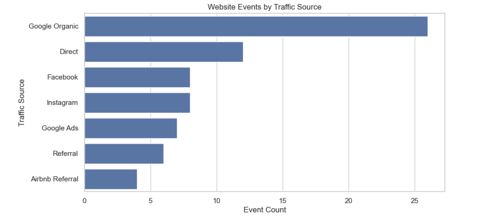
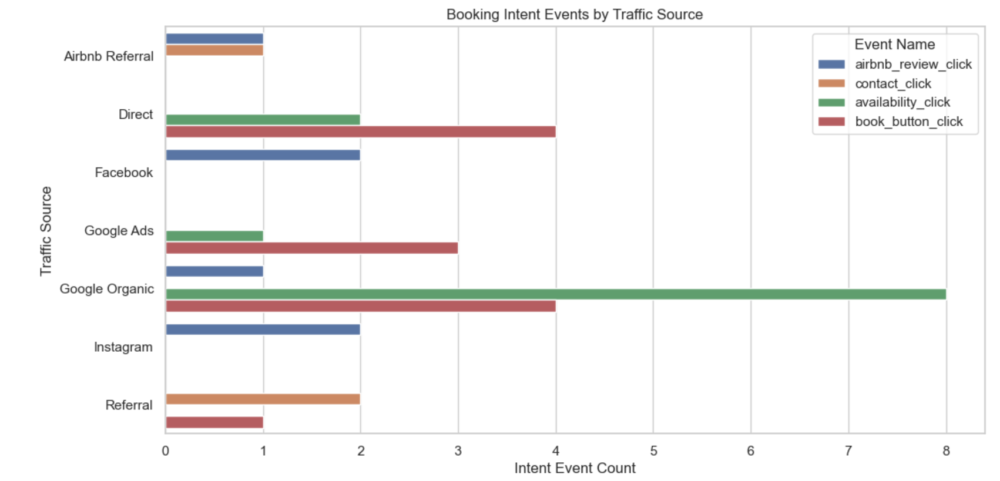
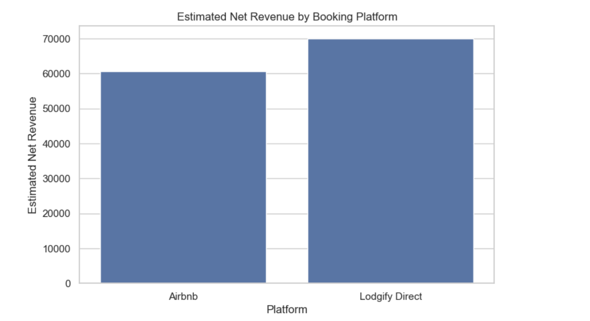
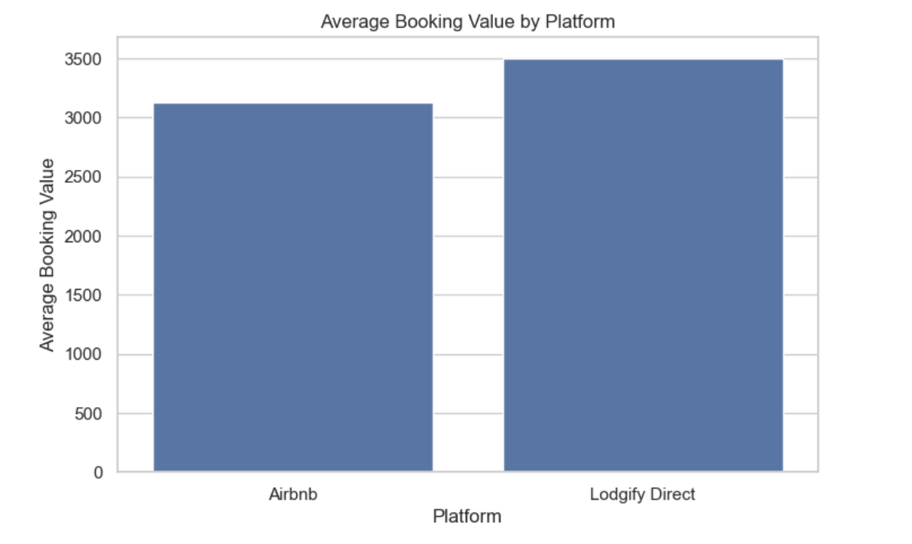

# Shortoff Booking Intelligence Dashboard

## Project Overview

This project is a business intelligence analysis project for a privately owned vacation rental business, Shortoff Mountain Retreats.

The project combines website event data, direct-booking data, and Airbnb-style booking data to compare marketing channels, booking behavior, revenue performance, and direct-booking opportunity.

The goal is to understand which traffic sources and booking platforms create the most profitable reservations and where guests may be dropping off before booking.

## Business Problem

Shortoff Mountain Retreats receives traffic and bookings from multiple sources, including direct website visitors, Lodgify/direct booking, Airbnb, Google, social media, and referrals.

Without a combined view of website behavior and booking-channel revenue, it is difficult to answer basic business questions:

- Which traffic sources create booking intent?
- Which booking channel produces the most revenue?
- Do direct bookings retain more revenue than Airbnb bookings?
- Are guests using Airbnb reviews as a trust signal before booking direct?
- Where should marketing effort be focused?

## Tools Used

- Python
- Pandas
- Jupyter Notebook
- SQL
- SQLite
- Matplotlib
- Seaborn
- Streamlit
- Git
- GitHub

## Data Sources

This public repository uses synthetic sample data for privacy and business-security reasons.

The sample data includes:

- Website events
- Lodgify/direct booking records
- Airbnb-style booking records

The private business version can use real booking and website data, but real guest information, exact revenue exports, platform records, and credentials are excluded from this public repo.

## Key Metrics

The project analyzes:

- Website events by traffic source
- Booking-intent events by traffic source
- Airbnb review-link clicks
- Revenue by booking platform
- Estimated net revenue by platform
- Average booking value
- Average revenue per night
- Monthly revenue trends
- Booking count by platform

## Project Structure

```text
shortoff-booking-intelligence/
├── data_sample/
│   ├── sample_website_events.csv
│   ├── sample_lodgify_bookings.csv
│   ├── sample_airbnb_bookings.csv
│   ├── clean_website_events.csv
│   ├── clean_lodgify_bookings.csv
│   └── clean_airbnb_bookings.csv
├── notebooks/
│   └── booking_intelligence_analysis.ipynb
├── src/
│   ├── clean_website_events.py
│   ├── clean_lodgify.py
│   ├── clean_airbnb.py
│   ├── data_cleaning_utils.py
│   └── build_database.py
├── sql/
│   └── marketing_metrics.sql
├── docs/
│   ├── project_brief.md
│   ├── data_source_notes.md
│   └── screenshots/
├── README.md
├── requirements.txt
└── .gitignore
```

Note: `data_private/` is used locally only and is excluded from GitHub through `.gitignore`.

## Capstone Streamlit Dashboard

This repository culminates in a Streamlit dashboard under `dashboard/`.

The dashboard turns the project analysis into an operator-facing decision surface for a small hospitality business. It combines sample reservation, web analytics, SEO, review, and business-health data to show how the underlying booking-intelligence model can support practical decisions around channel mix, direct-booking performance, marketing focus, and guest experience.

Live demo: [Shortoff Booking Intelligence Dashboard](https://shortoff-live-dashboard-n9dpou44xivdwgnfnyqbus.streamlit.app/)

Run locally:

```bash
cd dashboard
streamlit run app.py
```

The dashboard uses sample CSVs only. Private booking, guest, revenue, and credential data are intentionally excluded.

## Dashboard Screenshots

### Traffic by Source



### Booking Intent by Source



### Revenue by Platform



### Monthly Revenue by Platform


### Average Booking Value by Platform



## Sample Insights

Initial analysis shows several useful business questions the dashboard can support:

1. Google Organic and Direct traffic appear to generate strong booking-intent activity.
2. Airbnb may provide booking volume and trust through reviews, but direct bookings may retain stronger net revenue.
3. Airbnb review clicks should be treated as a high-intent trust signal.
4. Mobile and desktop behavior should be compared to identify potential booking friction.
5. Direct-booking conversion should be tracked because small improvements may increase retained revenue.

## How to Run

Install dependencies:

```bash
pip install -r requirements.txt
```

Run the cleaning scripts:

```bash
python src/clean_website_events.py
python src/clean_lodgify.py
python src/clean_airbnb.py
```

Build the SQLite database:

```bash
python src/build_database.py
```

Open the analysis notebook:

```bash
jupyter notebook notebooks/booking_intelligence_analysis.ipynb
```

Run the capstone Streamlit dashboard:

```bash
cd dashboard
streamlit run app.py
```

## SQL Analysis

The SQL file `sql/marketing_metrics.sql` includes queries for:

- Website events by traffic source
- Booking-intent events by traffic source
- Airbnb review clicks by traffic source
- Revenue by booking platform
- Monthly net revenue by platform
- Average stay length by platform
- Estimated Airbnb fee impact
- Direct booking retained revenue

## Privacy Note

This public repository uses synthetic sample data.

Real guest names, emails, phone numbers, reservation IDs, platform exports, exact booking records, revenue details, credentials, and private business files are not included.

The local `data_private/` folder is excluded through `.gitignore`.

## Future Improvements

Future versions could include:

- Real private Lodgify, Airbnb, and website analytics exports
- Google Analytics 4 event tracking
- Website conversion tracking
- Direct-booking funnel analysis
- Automated monthly reporting
- Lightweight forecasting for seasonal demand
